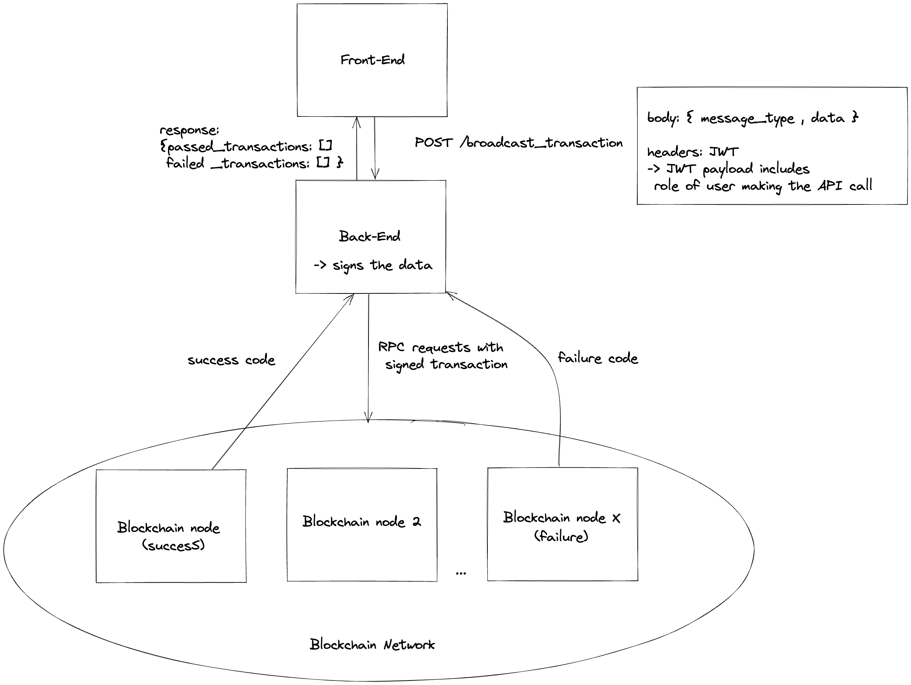

# Problem 6: Transaction Broadcaster Service

Fig.1 - System Diagram Overview

The general overview of the Transaction Broadcasts Service consists of
3 main components, the Front-End,Back-End and the Blockchain Network containing the blockchain nodes.

## 1. Initial interaction between the front-end and the back-end

The front-end will first make an API POST request to the back-end, with a body of the `message_type` and `data`.

The request also contains a header with a JWT token which carries a payload with a `role` field. The `role` contains the role of the user making the API request, mainly to differentiate between an admin and a non-admin.

## 2. Signing the data and initialising the broadcast service

Upon receiving the API request, the back-end then calls upon its internal service to sign the data, which outputs a signed transaction.

## 3. Broadcasting the signed transaction to the blockchain network

The back-end then initiates a RPC request with the signed transaction to a blockchain network.

On broadcast, it maintains 2 things:

1. A list of failed transactions
2. A list of successful transactions
3. A mapping of {transaction,retries_count} to keep track of the number of retries a transaction has taken.

As we expect a response of 30s for majority of the transactions, we can assume that the transaction has failed if the RPC request does not returns a response within 30s.

Upon failure of a transaction determined by a returned failure code or a timeout of 30s, we retry the transaction if the retries*count of the specific transaction to a blockchain node is below 5 ( \_We assume that 5 retries is a sufficiently good number to determine a failed transaction* ), if the retries_count exceed 5, we add the transaction the list of failed transaction and abort it.

Upon success of a transaction determined by a returned success code, we add the transaction to the list of successful transaction.

Upon the completion of all transactions, we return the list of failed and successful transactions as a response to the front-end, which renders a page that shows the list of transactions that passed or failed.

## 4. Retrying a broadcast

In the back-end service, we have a request interceptor to prevent concurrent API requests to `/broadcast_transaction` which re-triggers the broadcast service.

However, if the role of the user calling the API is an admin (determined by the header's JWT payload), we can abort the initial service and retry the broadcast.
